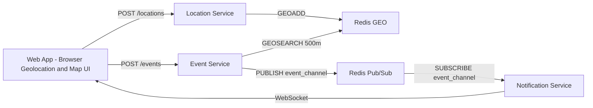

# System Design

`realtime_map_notice` 採用微服務架構，將高頻位置更新、事件處理與即時通知拆成不同服務，方便展示 Kubernetes 的擴展與容錯能力。

## 核心問題

這個系統的技術挑戰有兩個：

- 持續不斷的座標更新：大量使用者每秒上傳 GPS 位置。
- 瞬間的區域推播：事件發生後，需要快速找出 500 公尺內使用者並通知。
- 地圖畫面更新：使用者位置、事件 marker、通知位置需要在前端保持同步。

因此系統不適合每次都把即時座標寫入傳統關聯式資料庫。初步設計使用 Redis GEO 儲存目前位置，讓後端可以快速執行附近查詢。

即時性、地圖地點更新、容量規劃與瓶頸分析都整合在本文件中。

## 架構圖



架構分成三條主要路徑：

- 位置更新：Web App 定期把座標送到 Location Service，Location Service 更新 Redis GEO。
- 事件通知：Web App 發布事件，Event Service 查詢 500 公尺內使用者，再由 Notification Service 推播。
- 地圖更新：Web App 收到 GPS 或 WebSocket 訊息後，更新使用者 marker、事件 marker 與通知 Banner。

Redis GEO 與 Redis Pub/Sub 可以是同一個 Redis instance，但在架構圖中分開表示，方便說明不同資料結構與用途。

## 服務邊界

| 服務 | 負責 | 不負責 |
|------|------|--------|
| Web App | 地圖、定位、事件表單、通知展示 | 直接查 Redis、K8s 操作 |
| Location Service | 接收座標、更新 Redis GEO、附近查詢 | 事件建立、通知推播 |
| Event Service | 事件建立、半徑查詢、Redis PUBLISH 發布事件通知 | WebSocket 連線管理 |
| Notification Service | WebSocket、Redis Pub/Sub 訂閱、本地 GEOSEARCH 推播 | 判斷事件半徑、儲存位置 |
| Redis | 即時位置、last_seen、Pub/Sub channel | 長期報表、正式使用者資料 |

## 系統元件

Web App:

- 使用瀏覽器前端框架建立介面。
- 使用地圖元件顯示校園地圖、使用者定位與事件插旗。
- 使用 browser Geolocation API 取得目前位置。
- 定期上傳目前 GPS 座標。
- 透過 WebSocket 接收附近事件通知。
- 需要處理定位被拒絕、API 失敗、WebSocket 斷線重連與空狀態。

Location Service:

- 接收 `POST /locations`。
- 將使用者目前座標寫入 Redis GEO。
- 是主要高併發入口，也是 HPA 自動擴展展示對象。
- 不負責長期保存歷史軌跡，主要保存「目前位置」。

Event Service:

- 接收 `POST /events`。
- 使用事件座標查詢半徑內使用者。
- 透過 Redis Pub/Sub 發布事件通知。
- 是區域推播的主要商業邏輯位置。

Notification Service:

- 維護 WebSocket 連線。
- 訂閱 Redis Pub/Sub event_channel，接收事件通知。
- 根據事件座標做本地 GEOSEARCH，找出連線中的附近使用者。
- 透過 WebSocket 推播給符合條件的使用者。
- 已有 app-level ping/pong 心跳、離線通知佇列與重連回放機制。

Redis:

- 使用 GEOADD 儲存使用者目前位置。
- 使用 GEOSEARCH 查詢指定座標附近使用者。
- 使用 Pub/Sub 協助 Notification Service 多副本同步通知。
- Demo 階段可接受資料暫存在記憶體；正式產品需規劃資料持久化與備份。

Kubernetes:

- 使用 Deployment 管理每個微服務。
- 使用 Service 提供穩定內部網路入口。
- 使用 HPA 讓 Location Service 依 CPU 自動擴展。
- 使用多副本 Notification Service 展示容錯。

對外入口（後續展示/正式化需求）：

- Demo 初期可以使用 `localhost` 與 Docker Compose/Kubernetes port-forward。
- 若要讓教授、同學或非開發者更容易使用，建議註冊正式網域並交由 Cloudflare DNS 管理。
- 使用 Cloudflare Tunnel 將公開 hostname 連到本機或實驗室主機，不需要打開本機防火牆 inbound port。
- Cloudflare Tunnel 前方可提供 HTTPS、DNS proxy、基礎 WAF 與 DDoS 保護。
- WebSocket 可透過 Cloudflare proxy/Tunnel 轉發；Notification Service 仍需保留 ping/pong heartbeat，避免長連線閒置或中斷後殘留。
- 不建議直接把 `8001`、`8002`、`8003` 三個後端 port 分別暴露給使用者。正式入口應加一層反向代理，整理成單一網域與清楚路由，例如：

```text
https://map2.avision-gb10.org/              -> Web App
https://map2.avision-gb10.org/api/location  -> Location Service
https://map2.avision-gb10.org/api/events    -> Event Service
wss://map2.avision-gb10.org/ws/{user_id}    -> Notification Service
```

這層反向代理可以用 Nginx、Traefik 或 Kubernetes Ingress 實作。前端環境變數與後端 `CORS_ALLOW_ORIGINS` 需同步改成正式網域。

## API Contract

### `POST /locations`

用途：Web App 定期上傳使用者目前位置。

Request:

```json
{
  "user_id": "u-0001",
  "latitude": 25.0173,
  "longitude": 121.5397
}
```

正式版本建議擴充 `accuracy_meters`、`client_timestamp`、`sequence`、`source` 等欄位，用來處理定位精度、舊資料覆蓋新資料、模擬器資料與真實 GPS 資料的區分。

Response:

```json
{
  "status": "accepted",
  "user_id": "u-0001"
}
```

### `GET /locations/nearby`

用途：依指定座標查詢半徑內使用者。

Query:

```text
latitude=25.0173
longitude=121.5397
radius_meters=500
```

Response:

```json
{
  "users": ["u-0001", "u-0002"]
}
```

### `POST /events`

用途：建立事件並推播給附近使用者。

Request:

```json
{
  "client_event_id": "client-generated-uuid",
  "title": "Library seats",
  "message": "3F has seats near windows",
  "latitude": 25.0173,
  "longitude": 121.5397,
  "severity": "info",
  "expires_in": 30,
  "radius_meters": 500
}
```

`severity` 目前只接受 `info` 或 `urgent`。一般事件使用 `info`，需要區域推播與明顯提醒的事件使用 `urgent`。

`expires_in` 為事件有效期限（分鐘），範圍 1-1440，預設 30。超過有效期限的事件會自動過濾，不再顯示於地圖與查詢結果中。

`client_event_id` 為選填。前端或測試工具若提供穩定的 client-generated id，Event Service 會以 Redis `SET NX` 做 5 分鐘去重，避免重試或多副本情境下重複推播。

Response:

```json
{
  "event_id": "uuid",
  "nearby_user_count": 2,
  "delivered_count": 2,
  "delivered_to": ["u-0001", "u-0002"],
  "status": "created"
}
```

若收到相同 `client_event_id` 的重複請求，回應會使用既有 `event_id`，`status` 為 `duplicate`，且不會再次通知。

### `POST /events/{id}/comments`

用途：對事件新增留言。

Request:

```json
{
  "user_id": "u-0001",
  "content": "已處理完成，謝謝"
}
```

Response:

```json
{
  "comment_id": "uuid",
  "status": "created"
}
```

### `GET /events/{id}/comments`

用途：查詢事件的留言列表。

Response:

```json
{
  "event_id": "uuid",
  "comments": [
    {
      "comment_id": "uuid",
      "user_id": "u-0001",
      "content": "已處理完成，謝謝",
      "created_at": "2026-05-28T10:15:30Z"
    }
  ]
}
```

### `WS /ws/{user_id}`

用途：Web App 建立指定使用者的即時通知連線。

Message:

```json
{
  "event_id": "uuid",
  "title": "Urgent notice",
  "message": "Road blocked near library",
  "latitude": 25.0173,
  "longitude": 121.5397,
  "severity": "urgent",
  "distance_meters": 120.0
}
```

## Redis 資料設計

建議 key：

| Key | 類型 | 用途 |
|-----|------|------|
| `realtime_map_notice:user:locations` | GEO set | 儲存使用者目前座標 |
| `realtime_map_notice:user:last_seen:{user_id}` | String with TTL | 記錄使用者最後上傳時間 |
| `event_channel` | Pub/Sub channel | 事件推播 channel |
| `event_history` | LIST | 事件持久化（最新 100 筆） |
| `pending:{user_id}` | LIST | 離線通知佇列 |

位置資料的 TTL 策略：

- GEO set 本身沒有針對單一 member 的 TTL。
- 可用 `last_seen` 輔助判斷使用者是否仍在線。
- Location Service 的附近查詢與 Event Service 的事件通知都會檢查 last_seen 是否仍有效，避免回傳或通知太久沒上線的人。
- Demo 建議 last_seen TTL 設為 60 秒；正式版本可依電量、移動速度與隱私需求調整。

## 即時地圖更新需求

本專題中的「即時」是校園情境下使用者能感受到資訊接近現況，不是毫秒級金融交易。

| 項目 | 目標 |
|------|------|
| 使用者位置上傳頻率 | 每 1-3 秒一次，Demo 預設每 1 秒 |
| Web App 地圖使用者位置更新 | 收到新定位後 1 秒內更新畫面 |
| Location Service API 延遲 | 單次 `POST /locations` 目標小於 200ms |
| 附近查詢延遲 | `GEOSEARCH 500m` 目標小於 100ms |
| 緊急事件推播延遲 | 發布事件後 1-2 秒內通知附近使用者 |
| 使用者在線有效期限 | last_seen 超過 60 秒視為離線或不可靠 |

地圖地點更新分成三種：

- 使用者目前位置更新：Geolocation API 取得座標後更新 marker，並呼叫 `POST /locations`。
- 事件標記更新：發布事件成功或收到 WebSocket 通知後新增事件 marker。
- 通知位置更新：點擊通知 Banner 時，地圖移動到事件座標。

位置資料正式版本建議擴充：

```json
{
  "user_id": "u-0001",
  "latitude": 25.0173,
  "longitude": 121.5397,
  "accuracy_meters": 15,
  "heading_degrees": 180,
  "speed_mps": 1.2,
  "client_timestamp": "2026-05-24T10:15:30Z",
  "sequence": 42,
  "source": "gps"
}
```

其中 `accuracy_meters` 用來顯示定位精度，`sequence` 用來避免舊位置覆蓋新位置，`source` 用來區分 GPS、手動選點與 simulator。

## 非功能需求

效能：

- Location Service 需承受大量短請求。
- 初期壓測目標為 500-1,000 位虛擬使用者每秒更新一次座標；進階展示可挑戰 3,000 人。
- Event Service 發布事件時，500 位附近使用者的通知延遲目標小於 2 秒。
- 不同使用量下的 resource requests/limits、HPA 與瓶頸分析也整合在本文件中。

可靠性：

- Notification Service 至少 2-3 個 replicas。
- 刪除任一 Notification Pod 後，系統仍可接受新的 WebSocket 連線。
- Redis 若失效，位置查詢與通知都會受影響，Demo 前需確認 Redis Pod 狀態。

安全與隱私：

- Demo 階段使用假 user_id，不收集真實個資。
- 正式版本需加入認證、授權與位置資料保存期限。
- 位置資料不應長期保存，除非使用者明確同意。

## 容量規劃與瓶頸

使用量以「虛擬使用者每秒上傳位置」作為主要容量指標。

| 等級 | 虛擬使用者 | 約略位置更新量 | 目標 |
|------|------------|----------------|------|
| 少量使用 | 1-100 人 | 30-100 req/s | 功能驗證、本機開發 |
| 中量使用 | 500-1,000 人 | 500-1,000 req/s | 初期 Demo 與 HPA 展示 |
| 大量使用 | 3,000+ 人 | 3,000+ req/s | 進階壓測與架構討論 |

不同服務的調整方向：

| 元件 | 壓力來源 | 調整方式 |
|------|----------|----------|
| Location Service | 高頻 `POST /locations` | HPA 增加 replicas |
| Event Service | 事件發布與 Redis PUBLISH | 增加 replicas、Redis 連線池調整 |
| Notification Service | WebSocket 連線數與 Pub/Sub 訊息量 | 增加 replicas、心跳清理 |
| Redis | GEO 寫入、GEOSEARCH、Pub/Sub | 提高資源、分離 Redis、使用 managed Redis |
| Web App | marker 太多、頻繁 render | marker clustering、viewport filtering、throttling |

主要瓶頸：

- Location Service CPU 會隨位置更新量線性上升。
- Redis 可能成為單點瓶頸，因為 GEO 寫入、附近查詢與 Pub/Sub 都依賴它。
- Event Service 已改用 Redis Pub/Sub 架構，只做一次 PUBLISH（微秒級），不再有 HTTP fan-out 瓶頸。
- Notification Service 需要處理大量 WebSocket 長連線。
- Web App 在 marker 過多時可能卡頓，需要 clustering 或只顯示目前視窗範圍內事件。

## 資料流

位置更新流程：

```text
Web App -> Location Service -> Redis GEO
```

事件推播流程：

```text
Web App -> Event Service -> Redis GEO nearby query -> Redis LIST (persist)
Event Service -> Redis PUBLISH event_channel -> Notification Service SUBSCRIBE -> WebSocket -> Web App
```

## 區域推播邏輯

1. 使用者發布事件，包含標題、內容、座標、嚴重程度與推播半徑。
2. Event Service 使用 Redis GEO 查詢事件座標 500 公尺內的使用者。
3. Event Service 透過 Redis PUBLISH 發布事件到 event_channel。
4. Notification Service 訂閱 event_channel，收到事件通知。
5. Notification Service 在自己管理的 WebSocket 連線中做本地 GEOSEARCH，找出附近使用者並推播。

## Kubernetes 展示點

Auto-scaling:

- 使用 Python 腳本先模擬 500-1,000 位使用者，進階展示再提高到 3,000 位。
- 大量請求打到 Location Service。
- HPA 偵測 CPU 使用率上升後，將 Pod 從 1 個擴展到最多 8 個。
- 實測壓測結果（300→3000 用戶漸進式）：

| 並發用戶 | 無 HPA Location | 無 HPA Event | 有 HPA Location | 有 HPA Event | Pods（有HPA） |
|----------|-----------------|--------------|-----------------|--------------|---------------|
| 300 | 100% | 100% | 100% | 100% | 4 / 1 |
| 800 | 99.5% | 99.9% | **100%** | **100%** | 8 / 2 |
| 1500 | 93.2% | 95.5% | **99.1%** | **98.5%** | 8 / 2 |
| 2000 | 83.9% | 78.5% | **98.1%** | **99.9%** | 8 / 3 |
| 3000 | 94.8% | **0%** ❌ | **100%** | **100%** | 8 / 3 |

- HPA 配置：maxReplicas 8（Location + Event 各 8）、targetCPU 30%、cpu request 100m。
- 完整圖表比較報告見 `hpa_comparison.html`。

Fault tolerance:

- Notification Service 設定多副本。
- Demo 時手動刪除其中一個 Pod。
- Kubernetes 會自動重建 Pod。
- Service 會持續把流量導向健康 Pod。

Observability:

- 使用 `kubectl get pods -w` 觀察 Pod 狀態。
- 使用 `kubectl get hpa -w` 觀察自動擴展。
- 使用服務健康檢查 `/healthz` 判斷容器是否正常。

資源調整：

- 少量使用時以功能正確與低成本為主。
- 中量使用時調整 Location Service HPA，支援 500-1,000 人初期壓測。
- 大量使用時需要檢查 Redis、Event Service fan-out 與 Notification Service WebSocket 連線數是否成為瓶頸。

Demo 時可說明的技術點：

1. 傳統論壇需要使用者自己刷新與搜尋，這個系統會根據目前座標主動通知。
2. Redis GEO 適合高頻位置更新與附近查詢。
3. WebSocket 讓緊急事件可以由伺服器主動推播，不必等使用者刷新。
4. Kubernetes HPA 可針對高壓的 Location Service 做水平擴展。
5. 微服務讓不同服務依照自己的壓力來源獨立調整資源。

## 已確認的改善項目

### CORS

三個後端服務已加入 `fastapi.middleware.cors.CORSMiddleware`。前端開發伺服器（如 Vite port 5173）與後端（port 8001-8003）不同 origin，因此需要透過 `CORS_ALLOW_ORIGINS` 設定允許來源。預設允許：

```text
http://localhost:5173,http://localhost:3000,https://map2.avision-gb10.org
```

正式部署時應改成正式網域，不建議長期使用 `*`。

### WebSocket 心跳

Notification Service 已加入 app-level ping/pong 心跳，用來降低 ghost connection 長時間佔用資源的風險：

- 伺服器每 15 秒發送 `{ "type": "ping" }`。
- Web App 收到後回覆 `{ "type": "pong" }`，並忽略此控制訊息，不顯示成事件通知。
- 後端同時持續讀取 WebSocket client 訊息，斷線時會取消推播 task 並清理 pubsub subscription。
- 已實作離線通知佇列（pending queue），WebSocket 重連後自動回放；未來可補上訊息確認（ack）機制。

### Event Service 通知 fan-out 瓶頸（已解決）

已改用 Redis Pub/Sub 架構：Event Service 只做一次 Redis PUBLISH（微秒級），不再對每位附近使用者發送 HTTP POST。Notification Service 訂閱 event_channel 後自行做本地 GEOSEARCH + WebSocket 推播。HTTP fan-out 瓶頸已完全消除。

### Event Service 多副本冪等性

Event Service 支援選填的 `client_event_id`。當前端或壓測工具在重試同一事件時提供相同 `client_event_id`，後端會使用 Redis `SET NX` 記錄 event id，TTL 預設 300 秒。重複請求會回傳 `status="duplicate"` 且不再次發送通知。

限制：

- 若 client 沒有提供 `client_event_id`，系統仍會視為新事件。
- 此機制主要處理 client retry 與短時間重複提交，不是完整 exactly-once delivery。

## 初步限制

- 尚未設計正式使用者帳號與權限。
- 即時位置目前只保留短期用途，不作長期軌跡分析。
- WebSocket 推播已有斷線重連、app-level 心跳與離線通知佇列（pending queue）；正式產品仍需要補上訊息確認（ack）機制。
- 500 公尺為預設 Demo 半徑，未來可依事件類型調整。
